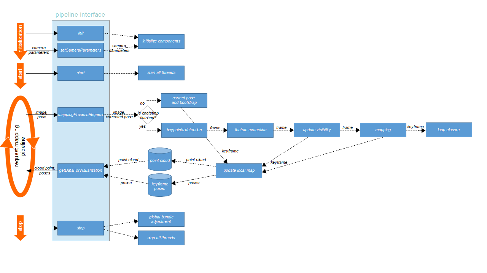
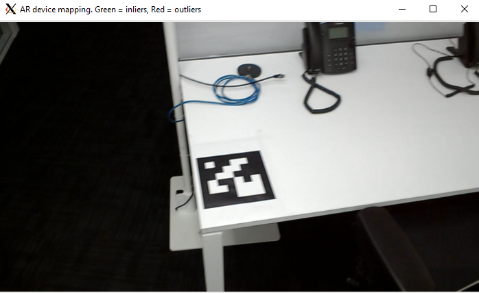
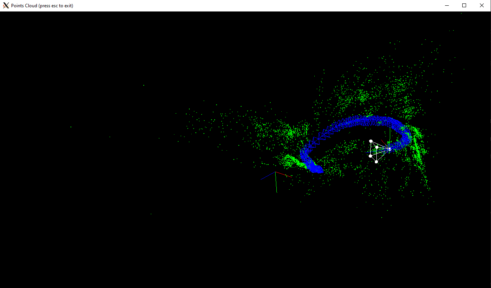

{::options parse_block_html="true" /}

# ARCloud Mapping Service 
[](https://www.apache.org/licenses/LICENSE-2.0)

## Introduction

The purpose of this documentation is to present the *ARCloud Mapping Service*: a computer vision pipeline dedicated to Augmented Reality (AR) applications and ready to be deployed on a Cloud architecture.

First, we will present the mapping pipeline on which this remote service is based. Then, we will describe how to configure and deploy the service on a Cloud architecture. And finally, we will explain how to test this mapping service using a sample application.

## Contents of the Mapping Service package=

The Mapping Service is delivered as a package containing all the files you need to deploy and test this computer vision pipeline on your own Cloud architecture.

This package includes:

- the **Docker image file** of the remote service: _mapping-multi-remote.tar_

- **two test client applications**, grouped in the folder _SolARPipeline_Mapping_Multi_Clients_ which contains:

* the **Producer client application** : _SolARPipelineTest_Mapping_Multi_Remote_Producer_
* the **Producer client configuration** : _SolARPipelineTest_Mapping_Multi_Remote_Producer_conf.xml_
  * a **script to launch the producer application**: _start_producer.sh_
  * the **Viewer client application** : _SolARPipelineTest_Mapping_Multi_Remote_Viewer_
  * the **Producer client configuration** : _SolARPipelineTest_Mapping_Multi_Remote_Viewer_conf.xml_
  * a **script to launch the viewer application**: _start_viewer.sh_
  * all the **libraries needed by the two test applications**, stored in the _modules_ folder
  * the ***data needed by the two test applications**, stored in the _data_ folder

<div class="panel panel-info">
**Note**
{: .panel-heading}
<div class="panel-body">

The complete projects of these two test applications are available on the **SolAR Framework GitHub**:

https://github.com/SolarFramework/Sample-Mapping/tree/0.9.3/Mapping/SolARPipeline_Mapping_Multi_Remote/tests/SolARPipelineTest_Mapping_Multi_Remote_Producer
https://github.com/SolarFramework/Sample-Mapping/tree/0.9.3/Mapping/SolARPipeline_Mapping_Multi_Remote/tests/SolARPipelineTest_Mapping_Multi_Remote_Viewer

</div>
</div>

<div class="panel panel-Caution">
**Caution**
{: .panel-heading}
<div class="panel-body">

The Mapping Service Docker image, based on Ubuntu 18.04, is completely independant from other external resources, and can be deployed on any Cloud infrastructure that supports Docker containers.

</div>
</div>

<div class="panel panel-Caution">
**Caution**
{: .panel-heading}
<div class="panel-body">

 The test client applications were built on a **Linux** operating system (Ubuntu 18.04) and must be used on that system only.

</div>
</div>

## The Mapping Pipeline 

This computer vision pipeline has been developed using the **SolAR Framework**, an open-source framework under [Apache v2 licence](https://www.apache.org/licenses/LICENSE-2.0) dedicated to Augmented Reality. 

The objective of this mapping pipeline is to build a 3D sparse map surrounding the AR device for visualization and relocalization, based on images and their poses provided by the tracking system of the AR device.

The processing of this pipeline is divided into <ins>three main steps</ins>:

1. The **bootstrap**: This step aims to define the first two keyframes and to triangulate the initial point cloud from the matching keypoints between these keyframes.
2. The **mapping**: Firstly, this step updates the visibilities of the features in each input frame with the 3D point cloud. Then, it tries to detect new keyframes based on these visibilities. Once a new keyframe is found, it is triangulated with its neighboring keyframes to create new 3D map points. Finally, a local bundle adjustment is performed to optimize the local map points and the poses of keyframes.
3. The **loop closure**: Although the use of the tracking system built into the AR device provides high accuracy of the poses, the pose errors still accumulate over time. Therefore, the loop closure process allows to optimize the map and the keyframe poses, as well as to avoid creating a redundant map when AR devices return to the pre-built area. 

To initialize the mapping pipeline processing, a device must give **the caracteristics of the camera** it uses (resolution, focal).

Then, the pipeline is able to process images and poses. To do this, some <ins>input data# are needed</ins>:

- **the images captured by the device** (images are sent to the pipeline one by one)
- **the relative position and orientation of the capture device**, for each image

And finally, after the pipeline processing, the <ins>output data# are</ins>:

- the **current map of the place** calculated by the pipeline from the first image to the current one (in fact, a **point cloud**)
- the **recalculated *positions and orientations of the capture device**, inside this point cloud, from the first image to the current one (in fact, only for some **keyframes** determined by the pipeline).

To facilitate the use of this pipeline by any client application embedded in a device, it offers a simple interface based on the _SolAR::api::pipeline::IMappingPipeline_ class (see https://solarframework.github.io/create/api/ for interface definition and data structures). +
This interface is defined as follows:

```cpp
    /// @brief Initialization of the pipeline
    /// @return FrameworkReturnCode::_SUCCESS if the init succeed, else FrameworkReturnCode::_ERROR_
    FrameworkReturnCode init() override;
```
```cpp
    /// @brief Set the camera parameters
    /// @param[in] cameraParams: the camera parameters (its resolution and its focal)
    /// @return FrameworkReturnCode::_SUCCESS if the camera parameters are correctly set, else FrameworkReturnCode::_ERROR_
    FrameworkReturnCode setCameraParameters(const datastructure::CameraParameters & cameraParams) override;
```
```cpp
    /// @brief Start the pipeline
    /// @return FrameworkReturnCode::_SUCCESS if the stard succeed, else FrameworkReturnCode::_ERROR_
    FrameworkReturnCode start() override;
```
```cpp
    /// @brief Stop the pipeline.
    /// @return FrameworkReturnCode::_SUCCESS if the stop succeed, else FrameworkReturnCode::_ERROR_
    FrameworkReturnCode stop() override;
```
```cpp
    /// @brief Request to the mapping pipeline to process a new image/pose
    /// Retrieve the new image (and pose) to process, in the current pipeline context
    /// (camera configuration, point cloud, key frames, key points)
    /// @param[in] image: the input image to process
    /// @param[in] pose: the input pose to process
    /// @return FrameworkReturnCode::_SUCCESS if the data are ready to be processed, else FrameworkReturnCode::_ERROR_
    FrameworkReturnCode mappingProcessRequest(const SRef<datastructure::Image> image,
                                              const datastructure::Transform3Df & pose) override;
```
```cpp
    /// @brief Provide the current data from the mapping pipeline context for visualization
    /// (resulting from all mapping processing since the start of the pipeline)
    /// @param[out] outputPointClouds: pipeline current point clouds
    /// @param[out] keyframePoses: pipeline current keyframe poses
    /// @return FrameworkReturnCode::_SUCCESS if data are available, else FrameworkReturnCode::_ERROR_
    FrameworkReturnCode getDataForVisualization(std::vector<SRef<datastructure::CloudPoint>> & outputPointClouds,
                                                std::vector<datastructure::Transform3Df> & keyframePoses) const override;
```
To complete the description of the mapping pipeline, the following diagram shows the different steps it implements, from initialization to the constitution of the point cloud:




The mapping pipeline sample is available on the *SolAR Framework GitHub* (multithreading version): https://github.com/SolarFramework/Sample-Mapping/tree/master/Mapping/SolARPipeline_Mapping_Multi

## The Mapping Service

In fact, this service is a remote version of the mapping pipeline presented previously, designed to be deployed in a Cloud architecture, to provide AR device applications with an easy way to benefit from this powerful SolAR Framework spatial computing algorithm.

### From the Docker image file

<div class="panel panel-Caution">
**Caution**
{: .panel-heading}
<div class="panel-body">

 In order to be able to perform the instructions presented in this part, you must have installed Docker on your computer: +
for Windows: https://www.docker.com/products/docker-desktop +
for Ubuntu: https://doc.ubuntu-fr.org/docker


</div>
</div>

To help you easily deploy the mapping service on your own infrastructure, we have already performed some preliminary steps:

* creation of a remote version of the mapping pipeline:
  * by adding a **gRPC server** based on the interface of this pipeline (which becomes the interface of the service), as described in the previous paragraph
  * by managing the **serialization and deserialization** of all the data structures that can be used to request the service through its interface

* encapsulation of the remote mapping pipeline in a **Docker container**, which exposes its interface through a default port

* generation of the corresponding **Docker image**

<ins>Step 1:</ins> Load the pre-built image in your Docker environment#

The result is a compressed file, *mapping-multi-remote.tar*, which must first be loaded in your own Docker environment to restore the image, using this command:

```command
docker load -i mapping-multi-remote.tar
```

Then, you can check if the image loaded correctly by listing all the images in your Docker system:

```command
docker image ls
REPOSITORY                                    TAG               IMAGE ID       CREATED        SIZE
artwin/solar/pipeline/mapping-multi-remote    latest            f613562d92a8   26 hours ago   2.05GB
```

<ins>Step 2</ins>: Upload the new image to your Docker registry#

The next step is to upload the mapping pipeline image to your own Docker repository, to make it available for deployment:

```command
docker login [repository name]
docker push artwin/solar/pipeline/mapping-multi-remote:latest
```

Then, check that this image is now available in your repository.

### To the deployment with Kubernetes

<div class="panel panel-Caution">
**Caution**
{: .panel-heading}
<div class="panel-body">

 In order to be able to perform the instructions presented in this part, you must have installed the Kubernetes command-line tool, *kubectl*, on your computer:
https://kubernetes.io/docs/tasks/tools/


</div>
</div>

When the mapping service Docker image is available on your registry, you are ready to deploy the service in your Cloud infrastructure, using Kubernetes. But before that, <ins>you must have prepared your Cloud architecture</ins>: set up a traffic manager, a load balancer, an application gateway, a firewall, servers, clusters, nodes...

#### Kubernetes manifest file

Then, you can use this **manifest sample** (in YAML format) to deploy the service:

```yaml
apiVersion: apps/v1
kind: Deployment
metadata:
  name: mapping-pipeline
spec:
  replicas: 1
  selector:
    matchLabels:
      app: mapping-pipeline
  template:
    metadata:
      labels:
        app: mapping-pipeline
    spec:
      imagePullSecrets:
      - name: regcredsupra
      containers:
      - name: mapping-pipeline
        image: supra-docker-virtual.repository.b-com.com/artwin/solar/pipeline/mapping-multi-remote:latest
        env:
        - name: XPCF_GRPC_SERVER_LOG_LEVEL
          value: INFO
        - name: XPCF_GRPC_MAX_RECV_MSG_SIZE
          value: "7000000"
        - name: XPCF_GRPC_MAX_SEND_MSG_SIZE
          value: "20000000"
        - name: XPCF_GRPC_MAP_UPDATE_URL
          value: map-update-pipeline.artwin.svc.cluster.local:80
---
kind: Service
apiVersion: v1
metadata:
  name: mapping-pipeline
  labels:
    app: mapping-pipeline
spec:
  type: NodePort
  selector:
    app: mapping-pipeline
  ports:
  - name: http
    port: 80
    targetPort: 8080
    nodePort: 31887
---
apiVersion: v1
kind: ServiceAccount
metadata:
  name: mapping-pipeline
---
apiVersion: rbac.authorization.k8s.io/v1
kind: ClusterRoleBinding
metadata:
  name: mapping-pipeline-rolebinding
roleRef:
  apiGroup: rbac.authorization.k8s.io
  kind: ClusterRole
  name: cluster-admin
subjects:
- kind: ServiceAccount
  name: mapping-pipeline
  namespace: mapping-pipeline.artwin.b-com.com:q
---
apiVersion: networking.k8s.io/v1
kind: Ingress
metadata:
  annotations:
    ingress.kubernetes.io/force-ssl-redirect: "true"
    kubernetes.io/ingress.class: nginx
    nginx.ingress.kubernetes.io/backend-protocol: "GRPC"
  name:
    mapping-pipeline
spec:
  tls:
  - hosts:
      - mapping-pipeline.artwin.b-com.com
  rules:
  - host: mapping-pipeline.artwin.b-com.com
    http:
      paths:
      - backend:
          service:
            name: mapping-pipeline
            port:
              number: 80
        path: /
        pathType: Prefix
```

<ins>**Deployment part** (*kind: Deployment*)</ins>

In this part of the manifest document, you need to define the service deployment parameters:

- name of the deployment
```yaml
metadata:
  name: mapping-pipeline
```

- number of replica pods for this deployment
```yaml
  replicas: 1
```

- label linked to the deployment object, used for identification
```yaml
  selector:
    matchLabels:
      app: mapping-pipeline
  template:
    metadata:
      labels:
        app: mapping-pipeline
```
- **container parameters**: this part is important because it defines the Docker image you want to deploy (in this sample *image: supra-docker-virtual.repository.b-com.com/artwin/solar/pipeline/mapping-multi-remote:latest*), 
and some parameters of the Docker container used at runtime:

* XPCF_GRPC_SERVER_LOG_LEVEL: the log level of the mapping pipeline (DEBUG, CRITICAL, ERROR, INFO, TRACE, WARNING)
* XPCF_GRPC_MAX_RECV_MSG_SIZE: the maximum size, in bytes, of gRPC received messages
* XPCF_GRPC_MAX_SEND_MSG_SIZE: the maximum size, in bytes, of gRPC sent messages
* XPCF_GRPC_MAP_UPDATE_URL: the local cluster URL to the Map Update Service (*not used in this version*)

```yaml
      containers:
      - name: mapping-pipeline
        image: supra-docker-virtual.repository.b-com.com/artwin/solar/pipeline/mapping-multi-remote:latest
        env:
        - name: XPCF_GRPC_SERVER_LOG_LEVEL
          value: INFO
        - name: XPCF_GRPC_MAX_RECV_MSG_SIZE
          value: "7000000"
        - name: XPCF_GRPC_MAX_SEND_MSG_SIZE
          value: "20000000"
        - name: XPCF_GRPC_MAP_UPDATE_URL
          value: map-update-pipeline.artwin.svc.cluster.local:80
```

<ins>**Service part** (*kind: Service*)</ins>

This part defines the name of the service, and, important, **the service node port**, which will be used by client applications to access its interface (in this example *31887*). The service port and target port must not be changed because they correspond to the definition of the ports of the Docker container (respectively *80* and *8080*).

```yaml
kind: Service
apiVersion: v1
metadata:
  name: mapping-pipeline
  labels:
    app: mapping-pipeline
spec:
  type: NodePort
  selector:
    app: mapping-pipeline
  ports:
  - name: http
    port: 80
    targetPort: 8080
    nodePort: 31887
```

<ins>**Ingress part** (*kind: Ingress*)</ins>

This last part is dedicated to the Ingress object that manages external access to the service. It defines important parameters such as **backend protocol**(*GRPC* for the mapping service), **host name** (*mapping-pipeline.artwin.b-com.com* in this example) and **service port number** as defined in the *service* part.

```yaml
kind: Ingress
metadata:
  annotations:
    ingress.kubernetes.io/force-ssl-redirect: "true"
    kubernetes.io/ingress.class: nginx
    nginx.ingress.kubernetes.io/backend-protocol: "GRPC"
  name:
    mapping-pipeline
spec:
  tls:
  - hosts:
      - mapping-pipeline.artwin.b-com.com
  rules:
  - host: mapping-pipeline.artwin.b-com.com
    http:
      paths:
      - backend:
          service:
            name: mapping-pipeline
            port:
              number: 80
        path: /
        pathType: Prefix
```

#### kubectl commands

To deploy or re-deploy the mapping service in your infrastructure, when your manifest file is correctly filled in, you can use the *kubectl* command-line tool to:

- define your **Kubernetes context** in a *.conf* file (cluster name, namespace, server address and port, user, certificates, etc.) like this:

```yaml
    apiVersion: v1
    clusters:
    - cluster:
        certificate-authority-data: ...
        server: https://...
    name: kubernetes
    contexts:
    - context:
        cluster: kubernetes
        namespace: artwin
        user: kubernetes-admin
    name: cluster-mapping
    current-context: cluster-mapping
    kind: Config
    preferences: {}
    users:
    - name: kubernetes-admin
    user:
        client-certificate-data: ...
        client-key-data: ...
```

and set it as default configuration:
```command
export KUBECONFIG=path/to/your_configuration.conf
```

- **set the context to use**:
```command
kubectl config use-context [context name]
```

you can also specify the default namespace:
```command
kubectl config set-context --current --namespace=[namespace]
```

- **deploy your service**:
```command
kubectl apply -f [path/to/your_manifest.yaml]
```

- **check your deployments**:
```command
kubectl get deployments
NAME               READY   UP-TO-DATE   AVAILABLE   AGE
mapping-pipeline   1/1     1            1           21d
```

- **check your services**:
```command
kubectl get services
NAME                      TYPE       CLUSTER-IP       EXTERNAL-IP   PORT(S)          AGE
mapping-pipeline          NodePort   10.107.117.85    <none>        80:31887/TCP     30d
```

- **check your pods**:
```command
kubectl get pods
NAME                                READY   STATUS    RESTARTS   AGE
mapping-pipeline-84bc74d954-6vc7v   1/1     Running   1          7d15h
```

- **visualize the logs of a pod**:
```command
kubectl logs -f [pod name]
```

- **restart a pod**: to do that, you can for example change an environment variable of the pod, to force it to restart
```command
kubectl set env deployment [deployment name] SOLAR_LOG_LEVEL=INFO
```

NOTE: You can find more kubectl commands on this web site: https://kubernetes.io/docs/reference/kubectl/cheatsheet/

## Mapping Service test samples

To verify if your Mapping Service is deployed correctly and is running as expected, we provide you with two client samples bundled with all the files (configurations, libraries, etc.) needed to run them as stand-alone applications.

### Producer client sample

This sample application is used to test the processing of images and poses carried out remotely by the Mapping Service. It uses a full set of pre-captured images taken from a Hololens device, included in this sample package.

The algorithm in this example is quite simple: it reads each pair of images and poses from the Hololens data files and requests the Mapping Service to process them, using this method from its interface:

```cpp
    /// @brief Request to the mapping pipeline to process a new image/pose
    /// Retrieve the new image (and pose) to process, in the current pipeline context
    /// (camera configuration, point cloud, key frames, key points)
    /// @param[in] image: the input image to process
    /// @param[in] pose: the input pose to process
    /// @return FrameworkReturnCode::_SUCCESS if the data are ready to be processed, else FrameworkReturnCode::_ERROR_
    FrameworkReturnCode mappingProcessRequest(const SRef<datastructure::Image> image,
                                              const datastructure::Transform3Df & pose) override;
```

Traces are displayed at runtime to follow the progress of the application. In addition, it displays each image read in a specific window to be able to visually follow the path of the Hololens device. 

<div class="panel panel-Caution">
**Caution**
{: .panel-heading}
<div class="panel-body">

 you must have a graphical display manager ruuning in your system to manage the image visualization


</div>
</div>

#### Configure the producer application

This sample application uses an XML configuration file to initialize at runtime: **SolARPipelineTest_Mapping_Multi_Remote_Producer_conf.xml**

You need to edit this file to match your own configuration. 

First, the _gRPC proxy configuration_ block of the _properties_ part has to be modified, to define the **URL of your Mapping Service**:

```xml
    <properties>
        <!-- gRPC proxy configuration-->
        <configure component="110a089c-0bb1-488e-b24b-c1b96bc9df3b">
            <property name="channelUrl" access="rw" type="string" value="[URL of your Mapping Service]"/>
            <property name="channelCredentials" access="rw" type="uint" value="0"/>
        </configure>
```

Then, if you want to change the rate of frames read from the Hololens dataset (actually, the **delay between two images, in milliseconds**), you can set the *delayTime* parameter in the configuration block of the *SolARDeviceDataLoader* component. In the following example, this delay is set to 250 ms:

```xml
    <configure component="SolARDeviceDataLoader">
        <property name="calibrationFile" type="string" value="./data/data_hololens/hololens_calibration.yml"/>
        <property name="pathToData" type="string" value="./data/data_hololens/loop_desktop_A"/>
        <property name="delayTime" type="int" value="250"/>
    </configure>
```

And if you want to **change the Hololens dataset** used by the sample application, in the same configuration block, just modify the property _pathToData_.

```xml
    <property name="pathToData" type="string" value="[path to your dataset]"/>
```

#### Launch the producer application

Once you have edited the XML configuration file, you are ready to launch the application. To do this, just use the predefined script file: *start_producer.sh*

Then, you can verify that the application is running correctly by looking at its traces:

```command
[2021-07-09 17:02:58:985680] [info] [  824] [main():197] Get component manager instance
[2021-07-09 17:02:58:985973] [info] [  824] [main():201] Load Client Remote Mapping Pipeline configuration file: SolARPipelineTest_Mapping_Multi_Remote_Producer_conf.xml
[2021-07-09 17:02:59:000145] [info] [  824] [main():205] Resolve IMappingPipeline interface
[2021-07-09 17:02:59:094552] [info] [  824] [main():216] Remote producer client: AR device component created
[2021-07-09 17:02:59:094801] [info] [  824] [main():219] Remote producer client: AR device component created
[2021-07-09 17:03:00:335424] [info] [  824] [main():230] Remote producer client: Init mapping pipeline result = SUCCESS
[2021-07-09 17:03:00:336157] [info] [  824] [main():234] Remote producer client: Set mapping pipeline camera parameters result = SUCCESS
[2021-07-09 17:03:00:336257] [info] [  824] [main():236] Remote producer client: Start remote mapping pipeline
[2021-07-09 17:03:00:338818] [info] [  824] [main():239] Start remote producer client thread
[2021-07-09 17:03:00:338965] [info] [  824] [main():253]
***** Control+C to stop *****
[2021-07-09 17:03:00:726830] [info] [  835] [operator()():73] Producer client: Send (image, pose) num 1 to mapping pipeline
[2021-07-09 17:03:02:717961] [info] [  835] [operator()():73] Producer client: Send (image, pose) num 2 to mapping pipeline
[2021-07-09 17:03:03:075171] [info] [  835] [operator()():73] Producer client: Send (image, pose) num 3 to mapping pipeline
[2021-07-09 17:03:03:465519] [info] [  835] [operator()():73] Producer client: Send (image, pose) num 4 to mapping pipeline
[2021-07-09 17:03:03:783061] [info] [  835] [operator()():73] Producer client: Send (image, pose) num 5 to mapping pipeline
...
```

And you will see the images loaded from the Hololens dataset in a dedicated window:




You can stop the application using _Ctrl+C_ keys.

```command
===> Program interruption
[2021-07-09 17:03:06:201309] [info] [  824] [SigInt():146] Stop producer client thread
[2021-07-09 17:03:06:280962] [info] [  824] [SigInt():151] Stop mapping pipeline process
[2021-07-09 17:03:06:352334] [info] [  824] [SigInt():156] End of test
```

### Viewer client sample

This sample application is used to check the result of the processing of images and poses carried out remotely by the Mapping Service. It continually resquests this service to get the current point cloud and keyframe poses resulting from all previously processed images, using this method from its interface:

```cpp
    /// @brief Provide the current data from the mapping pipeline context for visualization
    /// (resulting from all mapping processing since the start of the pipeline)
    /// @param[out] outputPointClouds: pipeline current point clouds
    /// @param[out] keyframePoses: pipeline current keyframe poses
    /// @return FrameworkReturnCode::_SUCCESS if data are available, else FrameworkReturnCode::_ERROR_
    FrameworkReturnCode getDataForVisualization(std::vector<SRef<datastructure::CloudPoint>> & outputPointClouds,
                                                std::vector<datastructure::Transform3Df> & keyframePoses) const override;
```

Traces are displayed at runtime to follow the progress of the application. In addition, it displays current point cloud and keyframe poses in a specific window to visualize the Mapping Service processing result. 

<div class="panel panel-Caution">
**Caution**
{: .panel-heading}
<div class="panel-body">

You must have a graphical display manager ruuning in your system to manage the image visualization


</div>
</div>

#### Configure the viewer application

This sample application uses an XML configuration file to initialize at runtime: *_SolARPipelineTest_Mapping_Multi_Remote_Viewer_conf.xml_*

You need to edit this file to match your own configuration. 

Only the *gRPC proxy configuration* block of the *properties* part has to be modified, to define the **URL of your Mapping Service**:

```xml
    <properties>
        <!-- gRPC proxy configuration-->
        <configure component="110a089c-0bb1-488e-b24b-c1b96bc9df3b">
            <property name="channelUrl" access="rw" type="string" value="[URL of your Mapping Service]"/>
            <property name="channelCredentials" access="rw" type="uint" value="0"/>
        </configure>
```

#### Launch the viewer application

Once you have edited the XML configuration file, you are ready to launch the application. To do this, just use the predefined script file: *start_viewer.sh*

Then, you can verify that the application is running correctly by looking at its traces:

```command
[2021-07-09 17:51:17:466319] [info] [20783] [main():134] Get component manager instance
[2021-07-09 17:51:17:466693] [info] [20783] [main():138] Load Client Remote Mapping Pipeline configuration file: SolARPipelineTest_Mapping_Multi_Remote_Viewer_conf.xml
[2021-07-09 17:51:17:467416] [info] [20783] [main():142] Resolve IMappingPipeline interface
[2021-07-09 17:51:17:579575] [info] [20783] [main():150] Start viewer client thread
[2021-07-09 17:51:17:579735] [info] [20783] [main():155]
***** Control+C to stop *****
[2021-07-09 17:51:18:052272] [info] [20807] [operator()():69] Viewer client: I3DPointsViewer component created
...
```

And you will see the current point cloud and keyframe poses in a dedicated window:



You can stop the application using _Ctrl+C_ keys.

```command
===> Program interruption
[2021-07-09 17:51:23:570390] [info] [20783] [SigInt():87] Stop viewer client thread
[2021-07-09 17:51:23:603042] [info] [20783] [SigInt():92] End of test
```